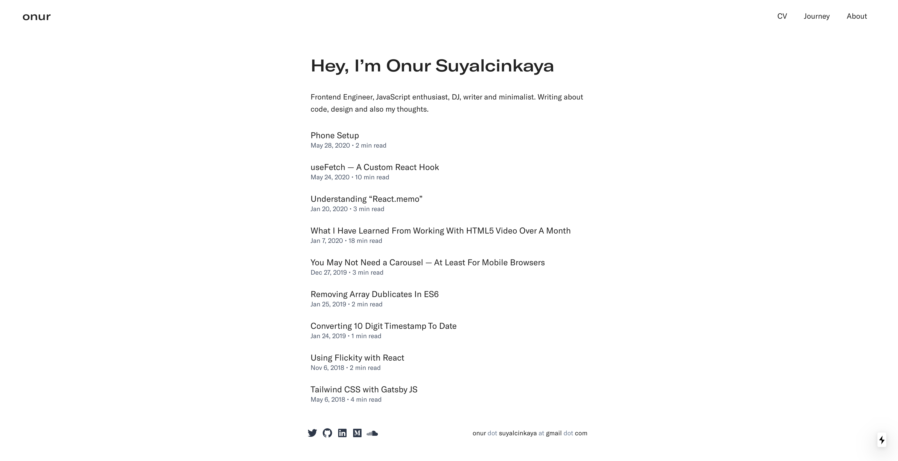

# onur.dev



<br>
<br>

My personal website has evolved over the years — from a simple static HTML page, to `Create React App`, to `GatsbyJS`,
then to a combination of `Next.js`, `Chakra UI` and `MDX`, and finally to a combination of `Next.js`, `Tailwind CSS` and
`Contentful`. It serves as an app-like-web platform for my writings, highlighting my journey, showcasing my bookmarks,
and more.

## Overview

- `/` — Home page.
- `/[slug]` — Static pre-rendered pages using [Contentful](https://www.contentful.com). (e.g. `/stack`)
- `/writing` — Writing page.
- `/writing/[slug]` — Static pre-rendered writing pages using [Contentful](https://www.contentful.com).
- `/journey` — Journey page.
- `/workspace` — Workspace page.
- `/bookmarks` — Bookmarks page.
- `/bookmarks/[slug]` — Static pre-rendered bookmarks pages using [Raindrop](https://raindrop.io/).
- `/bookmarks.xml` — Bookmarks XML feed.
- `/api` — API routes.

## Running Locally

```bash
$ git clone https://github.com/suyalcinkaya/onur.dev.git
$ cd onur.dev
$ bun i
$ bun dev
```

Create a `.env` file similar to [`.env.example`](https://github.com/suyalcinkaya/onur.dev/blob/master/.env.example).

## Tech Stack

- [Next.js](https://nextjs.org)
- [Tailwind CSS](https://tailwindcss.com)
- [shadcn/ui](https://ui.shadcn.com)
- [Contentful](https://www.contentful.com)
- [Raindrop](https://raindrop.io)
- [Supabase](https://supabase.com)
- [Vercel](https://vercel.com)

## Repo Activity


## License

1. Feel free to take inspiration from this code.
2. Avoid directly copying it, please.
3. Crediting the author is appreciated.

No complicated licensing. Be kind and help others learn.

> You can use the same license with: https://github.com/superkhau/lice

```bash
npm install -g lice
lice -l onur_dev
```
